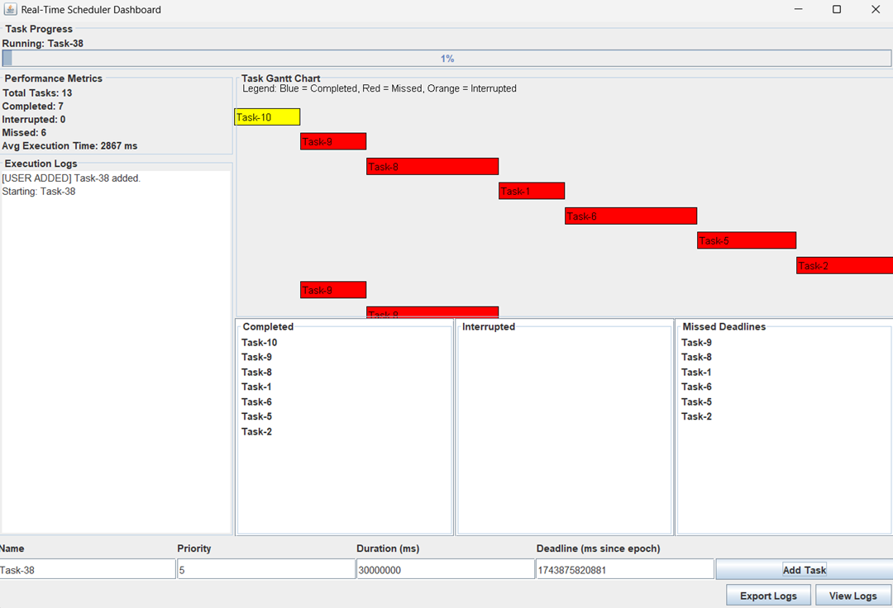
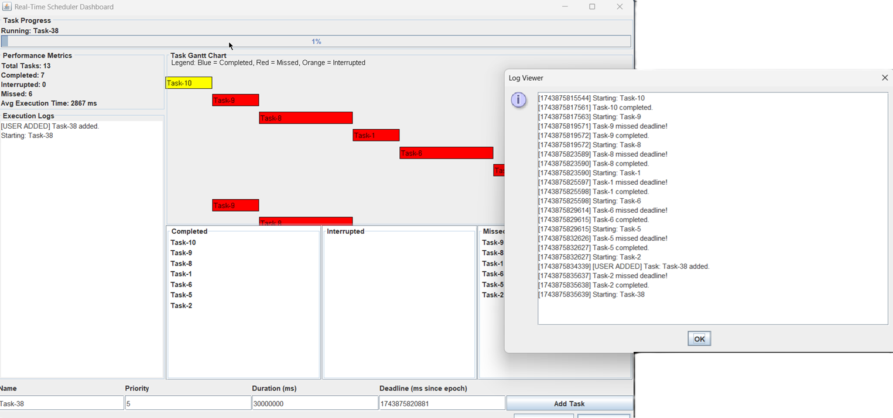

# Real-Time Scheduler

> A Java 17 Swing desktop application that simulates an OS-style, deadline-aware, preemptive task scheduler with live task control, policy-based dispatching, local persistence, notifications, metrics, and an operational dashboard.


---

## Overview

**Real-Time Scheduler** is a desktop simulation of a real-time scheduling system. It lets a user create tasks with priority, execution duration, deadline, category, recurrence, and retry configuration, then watch how a scheduler engine dispatches those tasks over time.

The project is useful for demonstrating concepts that appear in operating systems, backend task orchestration, event processing, embedded scheduling, production monitoring, and queue-based execution systems.

The current version is focused on a **Phase 4 desktop workflow**:

- clear separation between active work and historical task outcomes
- policy-driven dispatching using priority, deadlines, urgency, and aging
- live pause, resume, cancel, edit, clone, and retry workflows
- local notifications for operational events
- metrics, timeline visualization, logs, task details, and local persistence

> Note: This is a scheduler simulator, not a hard real-time operating system. It models scheduling behavior and task state transitions on a local JVM/Swing application.

---

## Demo

```markdown


```

---

## Key Features

### Scheduling engine

- **Priority-based scheduling** where `1` is the highest priority and `10` is the lowest priority.
- **Deadline-aware dispatching** with missed-deadline detection.
- **Preemptive simulation** where a running task can be requeued if a more urgent task becomes eligible.
- **Policy modes**:
  - `Priority First`
  - `Deadline First`
  - `Adaptive`
- **Aging support** to reduce starvation of lower-priority tasks.
- **Deadline urgency window** to identify tasks that are at risk of missing their deadlines.
- **Automatic retry support** for missed tasks, with retry tracking and backoff.
- **Recurring task support** for repeated task creation after completion.

### Desktop dashboard

- Java Swing-based dashboard.
- Active workspace for queued, deferred, running, and paused tasks.
- History view for completed, missed, and canceled tasks.
- Current task view.
- Task detail panels for active and historical records.
- Execution timeline / Gantt-style visualization.
- Performance metrics dashboard.
- Notification center with alert severity and unread state.
- Task progress visualization.
- Search, filters, sorting, and bulk actions.

### Operator controls

- Add tasks dynamically from the UI.
- Edit queued tasks.
- Pause and resume active tasks.
- Cancel tasks.
- Clone an existing task.
- Retry missed or completed task configurations.
- Bulk pause, resume, and cancel from the active workspace.
- Export logs and task reports.
- Open local data folder from the UI.

### Local persistence and observability

The application persists scheduler state locally under the user's home directory:

```text
~/.real-time-scheduler/tasks.ser
~/.real-time-scheduler/scheduler.log
~/.real-time-scheduler/scheduler-settings.ser
```

This allows the application to restore task state and policy settings after restart.

---

## Tech Stack

| Area | Technology |
|---|---|
| Language | Java 17+ |
| UI | Java Swing |
| Concurrency | Dedicated scheduler thread, synchronized state lock, concurrent collections |
| Queues | `PriorityBlockingQueue`, `PriorityQueue` |
| Persistence | Java serialization and local files |
| Visualization | Custom Swing panels and table models |
| Logging | Local scheduler log and in-memory log view |

---

## Project Structure

```text
Real-Time-Schedular/
├── Media/
│   ├── Demo.png
│   └── DemoLog.png
├── scheduler/
│   ├── RealTimeScheduler.java
│   ├── SchedulerEngine.java
│   ├── ScheduledTask.java
│   ├── TaskConfiguration.java
│   ├── TaskRequest.java
│   ├── TaskStatus.java
│   ├── SchedulingMode.java
│   ├── SchedulerPolicySettings.java
│   ├── SchedulerStateStore.java
│   ├── SchedulerSnapshot.java
│   ├── SchedulerMetrics.java
│   ├── SchedulerDashboard.java
│   ├── TaskFormPanel.java
│   ├── TaskInputPanel.java
│   ├── TaskEditorDialog.java
│   ├── TaskEditDialog.java
│   ├── TaskTableModel.java
│   ├── TaskHistoryPanel.java
│   ├── TaskHistoryTableModel.java
│   ├── TaskDetailsPanel.java
│   ├── TaskProgressPanel.java
│   ├── TaskChartPanel.java
│   ├── PerformanceMetricsPanel.java
│   ├── NotificationCenterPanel.java
│   ├── SchedulerAlert.java
│   ├── AlertSeverity.java
│   ├── AlertTableModel.java
│   ├── TaskReportExporter.java
│   └── LoggerUtil.java
├── .gitignore
├── LICENSE
└── README.md
```

---

## Important Classes

| Class | Responsibility |
|---|---|
| `RealTimeScheduler` | Application entry point. Initializes local state, logger, scheduler engine, shutdown hook, and Swing dashboard. |
| `SchedulerEngine` | Core scheduling loop. Owns the ready queue, deferred queue, task map, dispatch policy, preemption, deadline checks, retries, recurrence, and persistence triggers. |
| `ScheduledTask` | Domain model for task state, timing, execution progress, recurrence, retry, and task lifecycle transitions. |
| `TaskConfiguration` | Immutable-style task setup data used when creating or editing tasks. |
| `SchedulerPolicySettings` | Runtime scheduler policy: mode, aging, deadline urgency window, and automatic retry toggle. |
| `SchedulingMode` | Supported scheduling policies: Priority First, Deadline First, and Adaptive. |
| `SchedulerStateStore` | Local file persistence for tasks, scheduler logs, and policy settings. |
| `SchedulerDashboard` | Main Swing UI shell that wires the engine to dashboard panels. |
| `TaskTableModel` | Table model for live active tasks. |
| `TaskHistoryPanel` / `TaskHistoryTableModel` | Searchable and filterable historical task view. |
| `NotificationCenterPanel` | Displays alerts for completion, missed deadlines, cancelation, retries, and risk states. |
| `TaskChartPanel` | Timeline / Gantt-style visualization of task execution state. |
| `PerformanceMetricsPanel` | Shows scheduler-level metrics such as active count, history count, on-time rate, and average timings. |
| `TaskReportExporter` | Exports task/report data for review outside the app. |
| `LoggerUtil` | Local logging utility used by the scheduler and UI. |

---

## Architecture

```text
User actions
   |
   v
Swing Dashboard
   |
   v
SchedulerEngine
   |
   +--> Concurrent task map
   +--> Ready priority queue
   +--> Deferred queue
   +--> Scheduler policy settings
   |
   v
Task lifecycle updates
   |
   +--> SchedulerSnapshot for UI refresh
   +--> SchedulerMetrics for dashboard
   +--> SchedulerStateStore for local persistence
   +--> LoggerUtil and NotificationCenterPanel for observability
```

The engine uses a local scheduler loop and a small time slice to simulate task execution. At each cycle it activates deferred tasks, checks missed deadlines, dispatches the best eligible task according to the selected policy, and records state changes for the UI and local storage.

---

## Scheduling Behavior

### Priority rule

```text
1  = highest priority
10 = lowest priority
```

### Policy modes

| Policy | Behavior |
|---|---|
| `Priority First` | Prioritizes effective priority first, then deadlines and creation order. Aging can improve fairness. |
| `Deadline First` | Prioritizes the smallest slack / deadline pressure first, then effective priority. |
| `Adaptive` | Blends priority, aging, deadline urgency, and at-risk state to make a more balanced dispatch decision. |

### Task lifecycle

```text
Created
  -> Queued
  -> Running
  -> Completed

Queued / Running
  -> Paused
  -> Queued

Queued / Running / Paused
  -> Canceled

Queued / Running
  -> Missed
  -> Optional automatic retry task

Completed
  -> Optional next recurring occurrence
```

### Preemption model

The scheduler compares the currently running task with the best eligible task in the ready queue. If another task has stronger dispatch priority under the selected policy, the engine records a preemption, requeues the running task, and runs the better candidate.

This keeps the model close to OS-style scheduling while still remaining understandable and testable inside a Java desktop simulator.

---

## Requirements

- Java 17 or newer
- VS Code, IntelliJ IDEA, Eclipse, or a command-line terminal
- No Maven or Gradle is required for the current project layout

---

## Setup and Run

### 1. Clone the repository

```bash
git clone https://github.com/gokulsaraswat/Real-Time-Schedular.git
cd Real-Time-Schedular
```

### 2. Compile

```bash
javac scheduler/*.java
```

### 3. Run

```bash
java scheduler.RealTimeScheduler
```

### 4. Clean compiled classes

macOS / Linux:

```bash
find scheduler -name "*.class" -delete
```

Windows PowerShell:

```powershell
Get-ChildItem -Path scheduler -Filter *.class -Recurse | Remove-Item
```

---

## How to Use

1. Launch the app with `java scheduler.RealTimeScheduler`.
2. Add a task from the dashboard.
3. Provide:
   - task name
   - priority
   - duration
   - deadline
   - category / metadata when needed
   - recurrence or retry settings when needed
4. Choose or tune scheduler policy settings.
5. Watch the active workspace, current task, timeline, metrics, logs, and notification center.
6. Use task actions such as pause, resume, cancel, edit, clone, retry, and bulk operations.
7. Review completed, missed, and canceled work in the History tab.
8. Export logs or reports when you need an external record.

---

## Example Scenarios to Try

### Scenario 1: Priority preemption

1. Add a long low-priority task.
2. While it is running, add a short high-priority task.
3. Observe that the scheduler can preempt the lower-priority task and run the more urgent one first.

### Scenario 2: Deadline pressure

1. Switch to `Deadline First` or `Adaptive` policy.
2. Add tasks with similar priorities but different deadlines.
3. Watch how deadline slack changes dispatch order.

### Scenario 3: Aging and fairness

1. Add several high-priority tasks and one lower-priority task.
2. Enable aging.
3. Observe how long-waiting tasks become more competitive over time.

### Scenario 4: Missed deadline and retry

1. Add a task with a deadline that is too tight for its duration.
2. Enable automatic retry.
3. Observe the missed state, notification, and generated retry task.

### Scenario 5: Recurring task

1. Create a task with recurrence settings.
2. Let it complete.
3. Observe the next occurrence being scheduled automatically.

---

## Testing Checklist

Manual tests that are useful for this project:

- Add a valid task and confirm it appears in the active workspace.
- Add invalid task input and verify validation messages.
- Add several tasks with different priorities and deadlines.
- Confirm `Priority First`, `Deadline First`, and `Adaptive` policies change dispatch order.
- Confirm a task can be paused, resumed, canceled, cloned, and retried.
- Confirm a missed task moves to History.
- Confirm auto-retry creates a tracked retry task only when enabled.
- Confirm recurring tasks create the next occurrence after completion.
- Confirm notifications appear for important state changes.
- Confirm logs are written and exported.
- Restart the application and verify local task/policy state restoration.

---

## Interview Talking Points

This project is strong for interviews because it lets you discuss:

- Java OOP design and separation of concerns
- thread-safe state management
- priority queues and comparator design
- real-time scheduling tradeoffs
- starvation and aging
- deadline handling and retry policies
- Swing UI design and table models
- metrics and observability
- local persistence and recovery
- debugging race conditions and state transitions
- converting OS concepts into a usable desktop simulation

---

## Known Limitations

- This is a local simulator, not a hard real-time scheduler.
- It does not control actual OS process scheduling.
- It is single-machine and local-file based.
- Java serialization is convenient for this project, but a production system would likely use a structured format or database.
- Swing is practical for a desktop learning project, but a production monitoring dashboard may use a web UI.
- Timing behavior depends on JVM scheduling and host-machine load.

---

## Future Enhancements

- Add JUnit tests for scheduler policy behavior.
- Add JSON or CSV import/export for task definitions.
- Add backup and restore for the local state directory.
- Add richer report export for history and metrics.
- Add charts for throughput, wait time, missed-deadline trend, and preemption count.
- Add task templates and saved policy profiles.
- Add packaged releases for Windows/macOS/Linux.
- Add a REST API layer to make the scheduler remotely controllable.
- Add Prometheus/Grafana-style metrics if evolved into a service.
- Add pluggable scheduling strategies for experimentation.

---

## License

This project is licensed under the [MIT License](LICENSE).

---

Made with Java and Swing by **Gokul Saraswat**.
